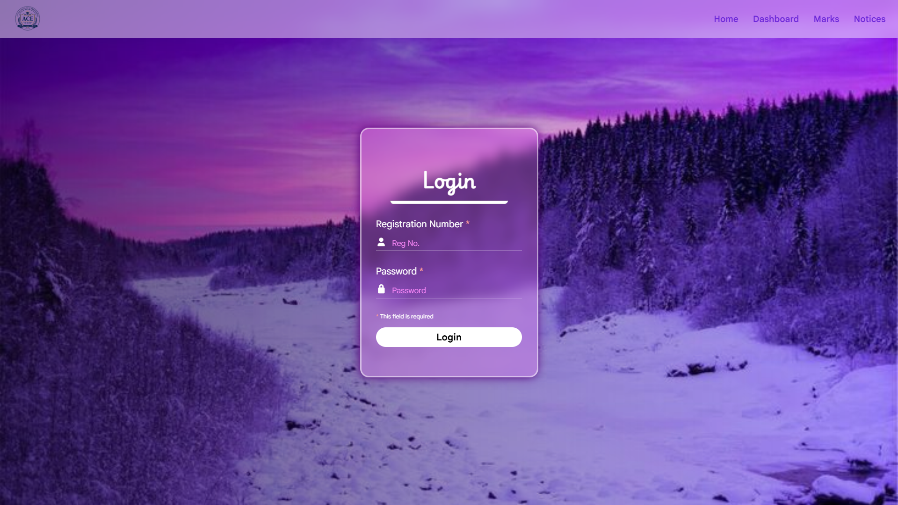
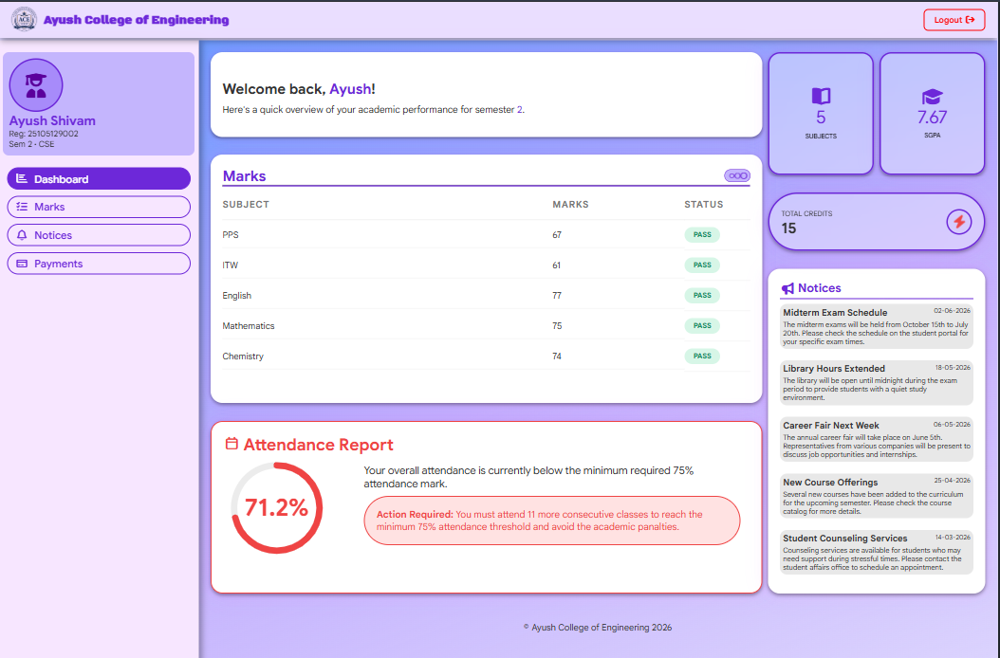
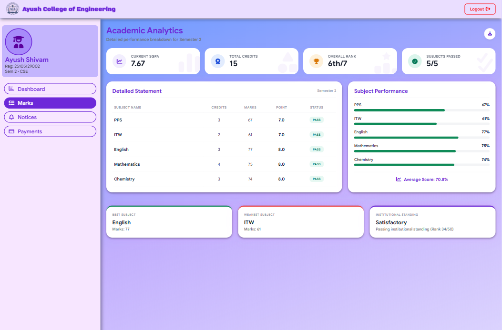
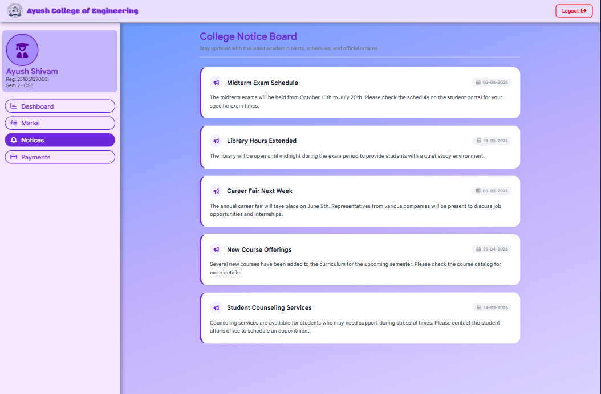
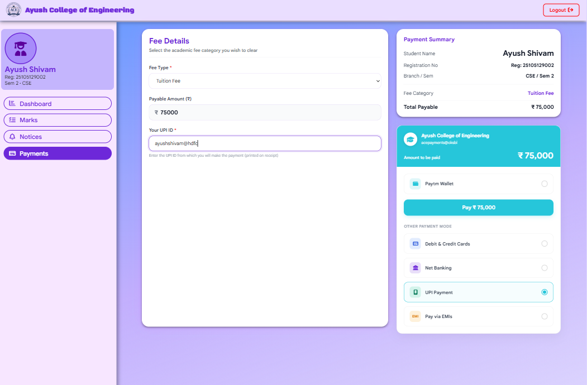
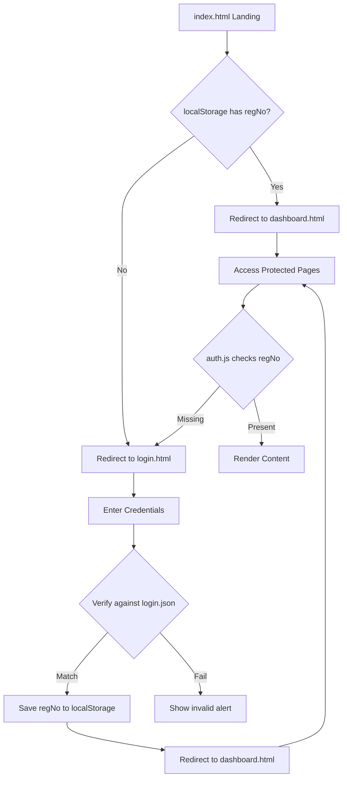
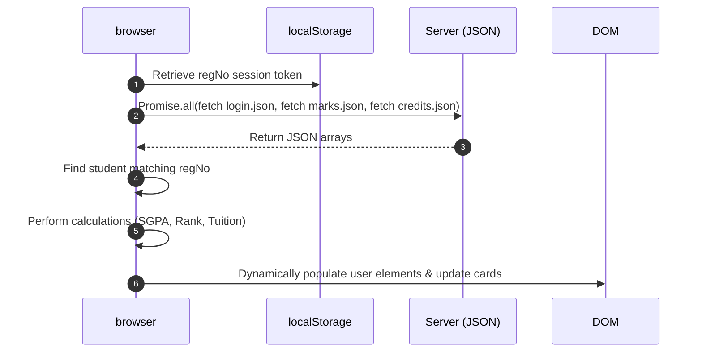

# Student Management System Website

A premium, responsive, frontend-only Student ERP Portal built with Vanilla web technologies. The project incorporates modern Glassmorphism aesthetics, dynamic data population from JSON files, client-side session authentication, and simulated checkouts with receipt PDF printing support.

🔗 **Live Demo**: [https://ace-students-portal.pages.dev/](https://ace-students-portal.pages.dev/)

---

## 🔗 Project Links & Badges

[](https://ace-students-portal.pages.dev/)
[](https://developer.mozilla.org/en-US/docs/Web/HTML)
[](https://developer.mozilla.org/en-US/docs/Web/CSS)
[](https://developer.mozilla.org/en-US/docs/Web/JavaScript)
[](LICENSE)

---

## 📖 Project Overview

This project is a mock **Student ERP Portal** designed to demonstrate advanced frontend development techniques without a backend or traditional database. 

It functions as a static multi-page ERP portal served on **Cloudflare Pages**, utilizing `localStorage` for student session data preservation and plain **JSON files** as flat-file databases. The portal features a unified design system using custom CSS properties, responsive flex/grid layouts, and micro-animations that respond to user actions.

---

## 🎯 Purpose

This project was developed to explore:

- Vanilla JavaScript architecture
- Responsive dashboard development
- JSON-based data handling
- Client-side authentication
- Reusable CSS design systems
- Modern UI/UX design patterns

---

## 📸 Screenshots

### Login


### Dashboard


### Marks


### Notices


### Payments


---

## ♻️ Code Reusability

- Shared dashboard styles reused using CSS @import
- Centralized authentication logic in auth.js
- Common logout handling through logout-js class
- Shared responsive navigation system across pages

---

## 🌟 Key Features

### 🔑 Client-side Authentication
* **Session Gatekeeper (`index.html` / `index.js`)**: Redirects users automatically based on their login state.
* **Credentials verification (`login.html` / `login.js`)**: Authenticates users against student records stored in `login.json`.
* **Session Persistence**: Saves the student's registration ID in `localStorage` upon success.
* **Route Protection (`auth.js`)**: Centralized authorization script that intercepts unauthorized traffic on all protected sub-pages.
* **Global Logout**: Standardized helper class (`.logout-js`) to clear credentials and force a logout redirect.

### 📊 Dashboard Page (`dashboard.html`)
* **Greet Box Card**: Custom welcome layout with mobile-adaptive profile card details (avatar, tricolor badge elements).
* **Summary Counters**: Dynamic student stats displaying SGPA, Total Course Credits, and Course count.
* **Academic Marks Ledger**: Dynamically loaded subjects, marks, and pointers rendered as a clean data grid.
* **Circular Attendance Gauge**: Interactive SVG progress ring with custom status alerts depending on attendance thresholds.
* **Notices Preview**: Renders the latest 5 announcements on the dashboard panel.

### 📝 Marks & Academic Analytics (`marks.html`)
* **Analytical Counters**: Computes class standings (Semester Rank vs. Institutional Standing).
* **Dual-Axis Class Rankings**:
  - **Overall Rank (Card)**: Displays formatting as `Rank/Total` (e.g. `6th/7`) among classmates of the **same semester only**.
  - **Institutional Standing (Highlight Card)**: Calculates the rank globally across **all students in all semesters** (e.g. `Rank 13/50 overall`).
* **Subject Performance Progress Bars**: Custom dynamic progress bars colored **green** for passed subjects (marks $\ge 35$) and **red** for failed subjects (marks $< 35$).
* **AI Highlights**: Auto-identifies and highlights the student's "Best Subject" and "Weakest Subject".
* **Vertical/Horizontal print alignments**: Preconfigured `@media print` rules format the analytics sheets for PDF downloads.

### 🔔 Notice Board (`notices.html`)
* **College Announcement Feed**: Feeds notices dynamically from `notices.json`.
* **Clean Notice Cards**: Glassmorphic card layouts with calendar date badges and megaphone icons.

### 💳 Payments Hub (`payments.html`)
* **Dynamic Fee Population**: Populates Hostel, Mess, Exam, Library, and Development fees from `payments.json`.
* **Semester-Based Tuition Fees**: Resolves tuition fees dynamically using the logged-in student's semester config (e.g., `sem2` matches `payments.tution.sem2`).
* **Interactive Fine Mode**: Selecting "Fine" toggles text descriptions and custom fine amount fields.
* **Paytm Replicated Checkout Widget**: A checkout card replicating modern merchant layouts:
  - Teal header background (`rgb(38, 198, 218)`) displaying the college merchant address `acepayments@oksbi`.
  - Radio options lists for Paytm Wallet (default), Cards, Net Banking, UPI, and EMIs.
  - **UPI ID Printer Tracking**: Selecting "UPI Payment" prompts the user to enter their source UPI ID.
* **Simulated Checkout Processor**: Validates inputs, shows a "Processing..." screen with loading animations for 2 seconds, and generates a random transaction ID prefixed with `ACE`.
* **Official E-Receipt**: Displays metadata (college name, transaction ID, date, student details, payment mode, and user's entered UPI ID).
* **Print Centering**: Uses print flexbox alignments to center the receipt vertically and horizontally on page exports.

---

## 📂 Folder Structure

```text
C:.
│   dashboard.html      # Main Student Dashboard panel
│   index.html          # Portal Entry point (Auth router)
│   login.html          # Sign-in portal page
│   marks.html          # Academic analytics sheet
│   notices.html        # Notice board announcements list
│   payments.html       # Payments hub and receipt generator
│   
├───assets              # Static images and brand logos
│       login-bg.jpeg
│       logo-transparent-blue.png
│       logo-transparent-white.png
│       logo.png
│       
├───data                # JSON flat-file databases
│       attendance.json
│       credits.json
│       login.json
│       marks.json
│       notices.json
│       payments.json
│
├───screenshots         # Includes Screenshots of all the pages
│       dashboard.png
│       login.png
│       marks.png
│       notices.png
│       payments.png
│       
├───scripts             # Client side Javascript modules
│       auth.js         # Route guards and logout listeners
│       dashboard.js    # Dashboard rendering & calculations
│       index.js        # Entry-point router
│       login.js        # Form handler & authentication
│       marks.js        # Analytics, rankings & margins
│       notices.js      # Notice lists dynamic populator
│       payments.js     # Checkout simulator & print receipts
│       
└───styles              # Responsive stylesheets
        dashboard.css   # Main design system rules
        index.css       # Loader page styles
        login.css       # Sign-in glass panel rules
        marks.css       # Grades table & analytics css
        notices.css     # Notice board card layouts
        payments.css    # Checkout mockup & print center rules
```

---


### Deployment Platform

Hosted on Cloudflare Pages

Benefits:
- Global CDN
- Free SSL
- Automatic GitHub deployment
- Fast static asset delivery

---

## Design Inspiration

The UI design was handcrafted using Vanilla CSS, with layout and visual inspiration partially taken from Google's Stitch AI design tool. AI-generated design concepts were used as a reference during the planning phase, while the final implementation, responsiveness, styling, animations, and component structure were developed and customized manually.

[Stitch](https://stitch.withgoogle.com/)

---

## ⚙️ Authentication & Data Flow

### Authentication Workflow


### Data Access Flow


---

## 📐 SGPA Calculation Engine

The Portal automatically computes the **Semester Grade Point Average (SGPA)** based on the grading system below:

### Grade Point Scale
| Marks Obtained | Grade Point Value |
| :---: | :---: |
| $90 - 100$ | `10` |
| $80 - 89$ | `9` |
| $70 - 79$ | `8` |
| $60 - 69$ | `7` |
| $50 - 59$ | `6` |
| $35 - 49$ | `5` |
| $< 35$ | `0` (FAIL) |

### Mathematical Formula
$$SGPA = \frac{\sum_{i=1}^{n} (Credit_i \times GradePoint_i)}{\sum_{i=1}^{n} Credit_i}$$

* **Pointers**: Looked up dynamically per subject from the student's entry in `marks.json`.
* **Credits**: Mapped per subject from the master list in `credits.json`.

---

## 🛠️ Installation & Local Setup

Since this is a static frontend website, you can run it locally without installing any web servers.

### Method 1: Python HTTP Server (Recommended)
1. Ensure Python is installed on your computer.
2. Open your terminal in the project directory.
3. Run the following command:
   ```bash
   # Python 3
   python -m http.server 8080
   ```
4. Open your browser and navigate to `http://localhost:8080`.

### Method 2: Node.js static server
1. Ensure Node.js is installed.
2. Run the static server using `npx`:
   ```bash
   npx serve ./
   ```
3. Navigate to the port displayed in the terminal.

---

## 🌐 Live Testing (No Cloning Required)

If you want to test the ERP portal and features instantly without setting up a local server, you can access the live deployed site directly:

👉 **Live Site Link**: [https://ace-students-portal.pages.dev/](https://ace-students-portal.pages.dev/)

---

## ⚠️ Disclaimer

This project is intended for educational and demonstration purposes.

Authentication, payments, and data storage are simulated entirely on the client side and should not be used in production environments without a secure backend.

---

## 📄 License

Distributed under the MIT License. See [LICENSE](LICENSE) for more information.
